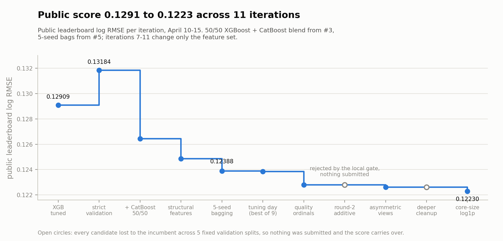
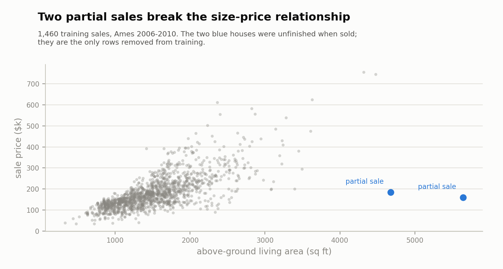
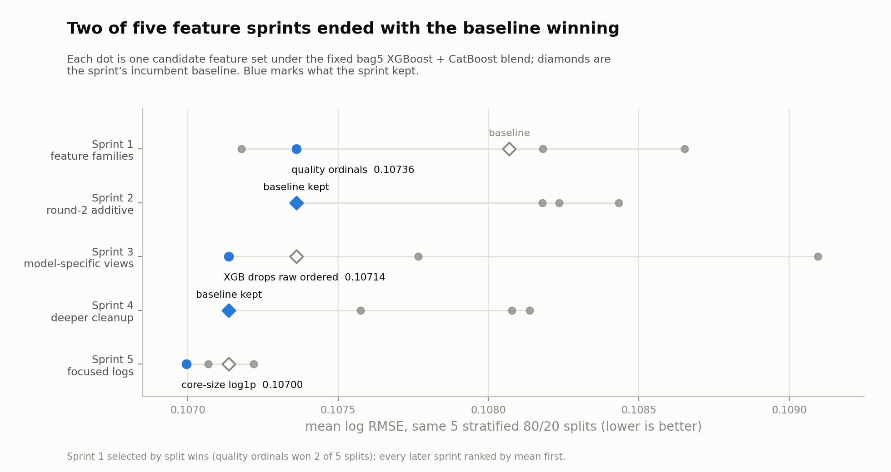
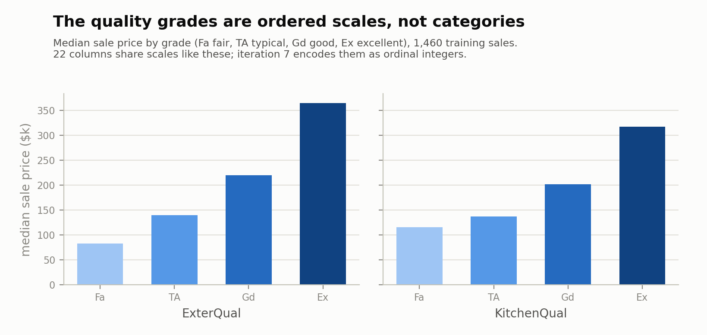
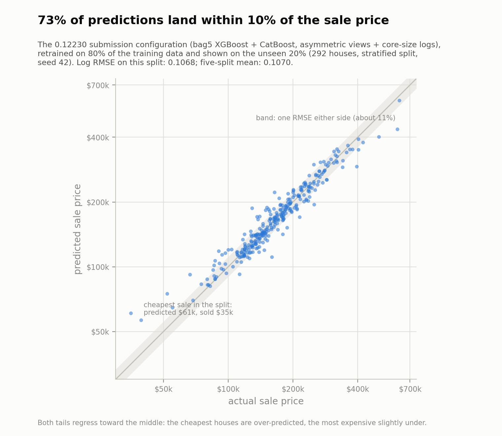

# House Prices: Advanced Regression

Predicting sale prices for houses in Ames, Iowa (1,460 training rows, 79 features) for the Kaggle competition [House Prices - Advanced Regression Techniques](https://www.kaggle.com/competitions/house-prices-advanced-regression-techniques). Scored on RMSE between the log of the predicted and the log of the actual price, so errors count relative to the price of the house.

**Result: public leaderboard score improved from 0.12909 to 0.12230 across 11 iterations in six days.** Two of those iterations shipped nothing, on purpose: the validation harness rejected the candidate features, and both times the next, narrower idea won instead.

## Results

| # | Configuration | Local validation | Public LB |
|---|---|---|---|
| 1 | XGBoost, tuned on a single split | n/a | 0.12909 |
| 2 | Same model re-selected under repeated-split validation | n/a | 0.13184 |
| 3 | 50/50 XGBoost + CatBoost blend | n/a | 0.12643 |
| 4 | + structural features (two rounds: sizes, ratios, ages) | n/a | 0.12486 |
| 5 | + seed bagging, 5 seeds equal weight | n/a | 0.12388 |
| 6 | Tuning day: submission blends, extra model diversity, Optuna (9 submissions) | n/a | 0.12384 |
| 7 | + ordinal encodings for 22 quality-scale columns | 0.1074 | 0.12280 |
| 8 | Broad additive round 2: subsystem totals, quality-size, effective age | 0.1082, lost to baseline | not submitted |
| 9 | Asymmetric views: XGBoost drops the raw ordered categoricals, CatBoost keeps them | 0.1071 | 0.12262 |
| 10 | Deeper XGBoost cleanups, one family at a time (3 variants) | all lost to baseline | not submitted |
| 11 | + `log1p` copies of LotArea, LotFrontage, GrLivArea and total SF, XGBoost side only | 0.1070 | **0.12230** |

Local validation is the mean log RMSE over 5 fixed stratified 80/20 splits. Iterations 1 to 6 predate the surviving notebooks; their public scores are the recorded Kaggle submissions, and rows 7 to 11 are fully reproducible from the notebooks in this repo. The headline stat of the project sits between rows 5 and 11: a full day of tuning and blending (row 6, nine submissions) improved the public score by 0.00004, while the three feature-representation sprints that followed improved it by 0.00158.

## The approach: every change had to beat the incumbent

**The data dictated the setup.** Four EDA findings carried direct consequences:

- The metric is RMSE on log price, so all local evaluation happens in log space, and every validation split is stratified by log-price decile so no split gets an accidental slice of the market.
- Four houses have more than 4,000 sq ft of living area. Two sold around $750k, right on trend; two sold under $200k, and both are `Partial` sales, priced before the house was finished. I dropped exactly those two rows and kept every other extreme point.
- The missing data is mostly structural absence: `PoolQC` is 99.5 percent missing because most houses have no pool. Categoricals got an explicit `Missing` level, numerics got medians, and `LotFrontage`, `MasVnrArea` and `GarageYrBlt` got was-missing indicator columns, because absence itself carries signal.
- 22 of the 43 text columns are graded scales (`Po`, `Fa`, `TA`, `Gd`, `Ex`) with monotone price ladders. One-hot encoding throws that order away. This became the project's most valuable observation, but it had to wait its turn behind the model work.

**An honest harness before anything else.** The first submission was an XGBoost tuned against a single validation split: 0.12909. Rebuilding the same model under repeated splits selected a configuration that scored 0.13184. The first number had been luck; the second one I could trust and build on. Every later decision went through the same gate: scout candidates on 3 stratified 80/20 splits, re-validate the shortlist on 5 fixed splits, rank by mean outer log RMSE, and submit only what beats the incumbent.

**Why add CatBoost?** A single GBDT's errors are correlated with themselves, and XGBoost only sees categoricals through one-hot columns. CatBoost handles them natively, so it makes different mistakes on the same rows. The first blend attempt scored 0.12706, and simplifying it to an equal 50/50 blend gave 0.12643, from 0.13184 one iteration earlier.

**Structural features, and a first public failure.** A refined age-flags family looked plausible and scored 0.12747, worse than its 0.12643 baseline. The systematic follow-up (size composites like total square footage, floor-balance ratios, quality-size interactions, age features) recovered the idea properly: 0.12505, then 0.12486 after a second round.

**Variance next: seed bagging.** The same blend trained on 5 seed pairs and averaged took 0.12388. Local validation called a tapered 7-seed bag a statistical tie with the 5-seed version; the public leaderboard preferred bag5 both times they went head to head later, by 0.0001 to 0.0002.

**The tuning day.** With the architecture fixed, one full day went into everything that is not representation: blending submission files, adding a third model for diversity, Optuna searches over both boosters. Nine submissions, best 0.12384, net improvement 0.00004. That settled the question of where the remaining signal lived: not in the parameters, in the features.

**Five validation-gated feature sprints (iterations 7 to 11).** Each sprint tested one family of representation ideas under the fixed bag5 blend, and the gate decided. Two sprints ended with the baseline winning and nothing submitted. Every submission that did go out beat the incumbent.

**Sprint 1: the ordinal encodings (0.12280).** The EDA's ordered-scales observation, finally cashed in: 22 graded columns mapped to ordinal integers, plus a few aggregates on top. Strict validation: 0.10736 against the 0.10807 baseline, and the first public score in the 0.122 range. A broad 10-column log-transform family was tested in the same sprint and failed the scout stage; that failure matters later.

**Sprint 2: the first rejection.** Three additive round-2 families (subsystem quality totals, quality-size interactions, effective-age utilities) all lost to the baseline on the 5-split gate, by 0.0008 to 0.0011. Nothing was submitted.

**Sprint 3: asymmetric feature views (0.12262).** After the ordinals, XGBoost was seeing every graded column twice, once one-hot and once ordinal, while CatBoost still profited from the raw categories natively. So the views split: CatBoost kept the full raw-plus-ordinal representation, XGBoost dropped the 21 raw ordered columns. Strict validation 0.10714, public 0.12262. The blend improved because its two members became less alike.

**Sprint 4: the second rejection.** If a leaner XGBoost view helped once, maybe more cleanup helps more. Three deeper cleanups (dropping year sources, quality aggregates, subsystem components) all lost to the sprint-3 winner. Baseline kept, nothing submitted.

**Sprint 5: the narrow version of a failed idea (0.12230).** Sprint 1 had rejected a broad log-transform family. A skew probe suggested the idea was right but the dose was wrong: only the core size columns carry enough signal to matter. Four `log1p` features (`LotArea`, `LotFrontage`, `GrLivArea`, total SF), added on the XGBoost side only, passed the gate at 0.10700 and finished at 0.12230.

**What the winner looks like against reality.** The exact submission configuration, retrained on 80 percent of the training data and shown on the unseen 20 percent: 73 percent of predictions land within 10 percent of the sale price, the median miss is 5 percent, and both tails regress toward the middle, the classic signature of tree ensembles that cannot extrapolate.

I stopped there. Four conservative blend files around the final winner were built but never submitted; the expected gain did not justify burning leaderboard feedback on them.

## Three lessons

1. **A gate that can say no keeps the score honest.** Two of five sprints ended with the baseline winning, and both times the next, narrower idea won instead. From the first sprint on, every submission beat the incumbent, because the losing ideas never reached the leaderboard.
2. **Representation beat tuning by a factor of 40.** One day of blending, diversity and hyperparameter search moved the public score by 0.00004; three feature sprints moved it by 0.00158. Once the model family is fixed, what the models see is the only lever that matters.
3. **The two models in a blend do not want the same features.** Both late wins came from making the views less alike: XGBoost dropped the raw ordered columns CatBoost kept, then took four log features CatBoost never saw. Every attempt after the ordinals to enrich both models with the same features failed the gate.

What I would try next: training on log price directly, since the metric lives there, and only then a small blend family around the winner.

## Notebooks

| Notebook | Contents |
|---|---|
| `notebooks/00_eda.ipynb` | EDA ending in the concrete consequences for the setup: metric, outlier policy, imputation, encoding and transform candidates |
| `notebooks/01_feature_engineering_sprint.ipynb` | Four feature families under one harness; quality ordinals win (row 7) |
| `notebooks/02_feature_engineering_round2_sprint.ipynb` | Three additive round-2 families; all rejected, nothing shipped (row 8) |
| `notebooks/03_feature_replacement_sprint.ipynb` | Model-specific feature views; XGBoost drops raw ordered categoricals (row 9) |
| `notebooks/04_feature_cleanup_sprint.ipynb` | Deeper XGBoost-only cleanups; all rejected, nothing shipped (row 10) |
| `notebooks/05_feature_skew_revisit_sprint.ipynb` | Focused skew handling: four `log1p` features take the final step (row 11) |

Every sprint notebook runs the same protocol: build candidate feature paths, scout all of them on 3 outer splits with a fixed bag5 XGBoost + CatBoost blend, re-validate the shortlist on 5 fixed splits ranked by mean outer log RMSE, re-check the bagging variants on the winner, and export versioned submission files.

## Reproducing

1. Download the competition data into `data/` with the Kaggle CLI:
   `kaggle competitions download -c house-prices-advanced-regression-techniques -p data --unzip`
2. Create the environment: `conda env create -f environment.yml`
3. Run the notebooks in order. Each one is self-contained (features are rebuilt from the raw CSVs) and writes its submission files to `submissions/`.

Everything runs on a laptop CPU; a full sprint notebook takes roughly half an hour. Re-running the sprint notebooks regenerates the submitted prediction files byte for byte, including the 0.12230 winner.
